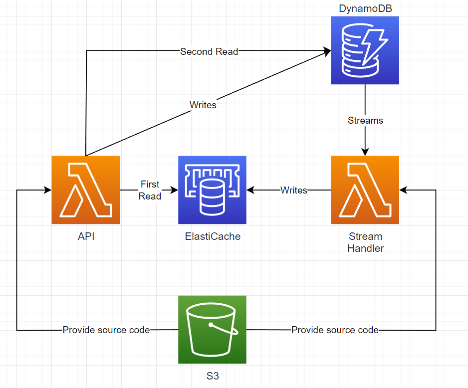

# Scenario 1
This scenario contains implementation of the following AWS Infrastructure Diagram:



The infrastructure should expose API hosted as Lambda which provides simple CRUD operations on DynamoDB table.
Every Create, Update or Delete operation is producing Stream which triggers the Stream handler lambda.
Stream handler lambda is separate from API and writes the records to the ElastiCache.
Every Read operation called on API is first handled by elasticache read. Cache miss results in calling the DynamoDB. 
Both Lambdas should be fed with the compiled source code placed in the special S3 bucket.

## Diagram elements

1. API - Simple CRUD operations hosted as Lambda
2. DynamoDB - Amazon Document Database where API store data and fetch from it when cache miss happens 
3. StreamHandler - Lambda triggered by DynamoDB streams and writing data to ElastiCache
4. ElastiCache - Redis distributed Cache instance
5. S3 - Storage used here to provide source for Lambda functions


### Get Started

To get started you need to clone this repository, provide `aws_access_key` and `aws_secret_key`
variable values and execute
```terraform
terraform init
terraform validate
``` 

### Caution

Resources created with this scenario might cost money.
Remember to destroy all resources when you're done

```terraform
terraform destroy
```

### Credits
Entry version of used C# source code for lambdas and Scenario idea was taken from
https://github.com/Elfocrash/aws-videos/tree/master/DynamoDbStreams 