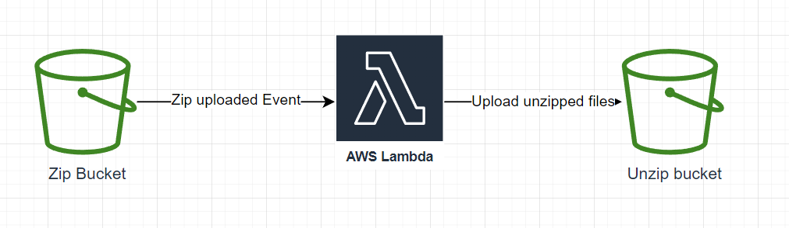

# Scenario 1
This scenario contains implementation of the following AWS Infrastructure Diagram:



The goal is to create 2 buckets: One for zip files and other for it's contents.
Each zip upload to first bucket should trigger and event for Lambda which will take the zip and upload its contents to the second bucket.

## Diagram elements

1. Zip bucket - S3 bucket containing `zip` files
2. AWS Lambda - Lambda triggered by zip file upload and uploading contents to the second bucket
3. Unzip bucket - S3 bucket containing contents of zips. The Key structure would be `file.zip/fileFromZip.extension`

### Get Started

To get started you need to clone this repository, provide `aws_access_key` and `aws_secret_key`
variable values and execute
```terraform
terraform init
terraform validate
``` 

### Running with LocalStack

To run the infrastructure locally you can can LocalStack as Docker Container.
At first you need to delete the `provider "aws"
` section and replace it with the following code:
```terraform
provider "aws" {
  access_key                  = "test"
  secret_key                  = "test"
  region                      = "us-east-1"
  s3_use_path_style           = false
  skip_credentials_validation = true
  skip_metadata_api_check     = true
  skip_requesting_account_id  = true

  endpoints {
    apigateway     = "http://localhost:4566"
    apigatewayv2   = "http://localhost:4566"
    cloudformation = "http://localhost:4566"
    cloudwatch     = "http://localhost:4566"
    dynamodb       = "http://localhost:4566"
    ec2            = "http://localhost:4566"
    es             = "http://localhost:4566"
    elasticache    = "http://localhost:4566"
    firehose       = "http://localhost:4566"
    iam            = "http://localhost:4566"
    kinesis        = "http://localhost:4566"
    lambda         = "http://localhost:4566"
    rds            = "http://localhost:4566"
    redshift       = "http://localhost:4566"
    route53        = "http://localhost:4566"
    s3             = "http://s3.localhost.localstack.cloud:4566"
    secretsmanager = "http://localhost:4566"
    ses            = "http://localhost:4566"
    sns            = "http://localhost:4566"
    sqs            = "http://localhost:4566"
    ssm            = "http://localhost:4566"
    stepfunctions  = "http://localhost:4566"
    sts            = "http://localhost:4566"
  }
}
```

Then visit the root of Scenario with CLI and run:

```
docker-compose up
```

Finally, you should be able to perform terraform commands and test infrastructure on localStack for free. 

### Caution

To actually deploy the infrastructure to the AWS, replace the `provider "aws" ` section with this

```terraform
provider "aws" {
  access_key = var.aws_access_key
  secret_key = var.aws_secret_key
  region     = var.aws_region
}
```

Resources created with this scenario might cost money if you dont deploy to LocalStack.
Remember to destroy all resources when you're done

```terraform
terraform destroy
```